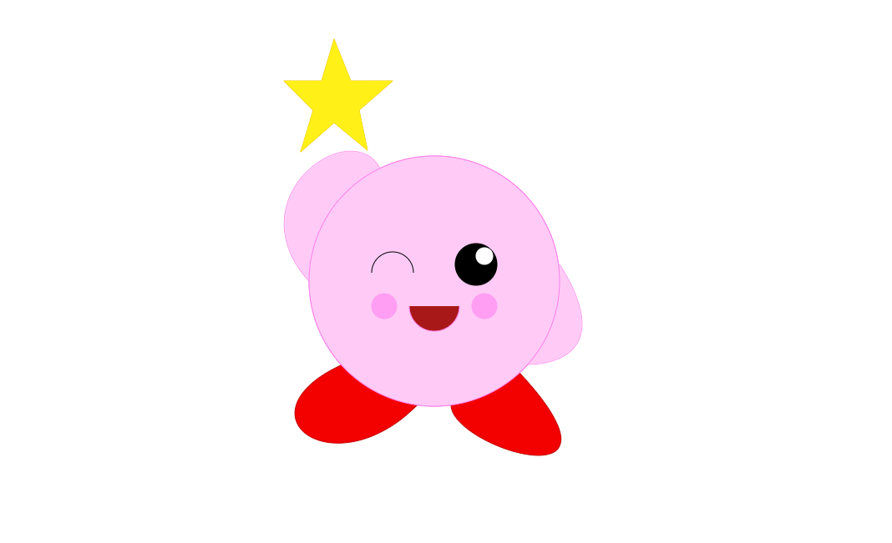

# desenho.canvas
## Desenho.canvas

 Essa é uma atividade passada em aula utilizando HTML e JavaScript. O objetivo do projeto é usar as formas no canvas e fazer um desenho utilizando JavaScript.
 
### Estrutura do projeto

 O projeto é composto pelos seguintes arquivos e pastas:
 * kirby.html-Página inicial site.
 * img/-Pasta de imagens com  o processo do projeto.
 * js/index.html- Arquivo JavaScript para desenhar no canvas.
  
### Desenvolvimento

Para criar o desenho, foram ultilizados os seguites passos:

1. estrutura do site:
 - Criar a estrutura básica do html e adicinar a tag canvas.
 - Adicionar o JavaScript.

2. Pegando id:
 - Foi pego o id do canvas com o nome de 'kirby', e depois foi pego o contexto 2d do canvas.
 - O canvas foi deixado do tamanho da tela.

3. Criando o corpo:
 
 - Primeiro foi criado um circulo com o 'ctx.arc()' com a cor base `#FFCBF6` e a cor do stroke sendo `#ff7fe9`.
 
 
 - Depois foi feitas duas curvas com o 'ctx.bezierCurveTo()' ligados ao circulo para criar os braços.
 
 
 - depois foi adicionas mais duas curvas ligadas ao circulo com a cor base `f30000` e a cor do stroke sendo `c40000` para criar os pés.
 
 
4. Criando o rosto:
 - Foi adicionado um circulo pequeno mais a direita com a cor base `#000000` e a cor do stroke sendo `#000000` para criar o olho, e um circulo mais pequeno com a cor base `white` para fazer o brilho do olho.
 - Depois foi adicionado um meio circulo com o `ctx.arc()` sem multiplicar o `Math.PI` por dois e `true` para que ele fique do lado certo com a cor ´#000000´ para criar o outro olho.
 - E por fim foi adicionado outro meio circulo mas com o estado `false` para que ele ficar virado pra cima, com a cor base `#A91818` para criar a boca.
 
 
5. criando a estrela:
 - Para criar a estrela foi adicionado 10 linhas com as `ctx.moveTo()` e `ctx.lineTo()` com a cor da stroke sendo `#F1C200`.
 

## Autores
Gabriele Batista Sousa e Arthur Victor Sousa Mascate 
